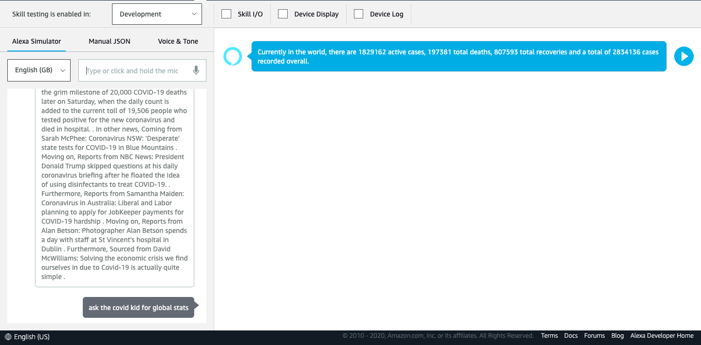
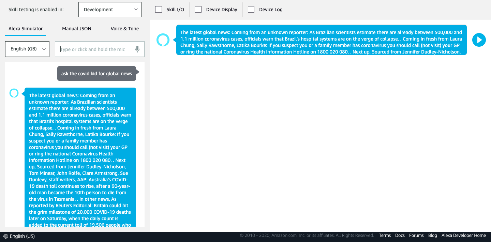
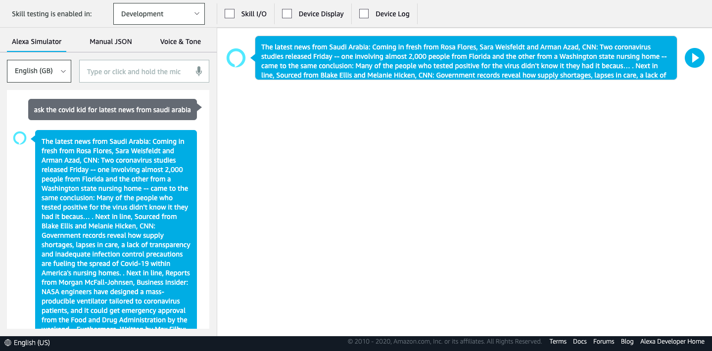
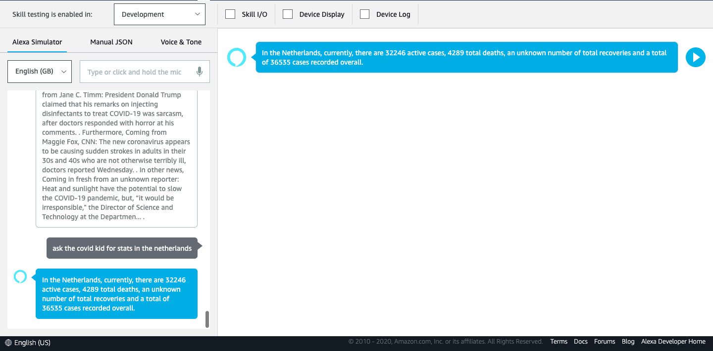

# Covid_Assistant

<h2 align="center"><strong>Covid-19 Assistant</strong></h2>

<em>Here is the link to the (NOT A WEBSITE) homepage (this page is just a basic homepage, the actual alexa requests are handled at /alexa) --> <a href='https://covid-alexa-assistant.herokuapp.com/alexa'>https://covid-alexa-assistant.herokuapp.com/alexa</a>
</em> 
 

This assistant provides the users with: 
<ol type="1">
  <li>The ability to get statistics (number of covid cases, deatha & recoveries).</li>
  <li>The ability to get statistics (number of covid cases, deatha & recoveries) from any country effected (with more than one case).</li>
  <li>The ability to get global news updates regarding the covid-19 pandemic.</li>
  <li>The ability to get news from any country substantially effected by the health crisis.</li>
  <li>Here are some sample utterances you can use to get the responses mentioned above:</li>
  <li type='none'>
      <ul style="list-style-type:circle;">
        <li><strong>Alexa, ask the covid kid </strong><em>for global news</em></li>
        <li><strong>Alexa, ask the covid kid </strong><em>for latest news from {your_country_name}</em></li>
        <li><strong>Alexa, ask the covid kid </strong><em>for global statistics/stats</em></li>
        <li><strong>Alexa, ask the covid kid </strong><em>for stats from {your_country_name}</em></li>
        <li><strong><em>There are several more similar utterances with providing the intended responses!</em></strong></li>
      </ul>
  </li>
</ol>
 

This virtual assistant utilizes:
<ul type='square'>
  <li>Python for scraping information from the worldometers site, for statistics --> <a href='corona-alexa-skill/scrape.py'>scrape.py</a></li></li>
  <li>Flask-ask as the backend for the Alexa Skill (Amazon Developer Kit) --> <a href='corona-alexa-skill/thing.py'>thing.py</a></li></li>
  <li>Python news_api to get the lates global and country specific news --> <a href='corona-alexa-skill/news.py'>news.py</a></li></li>
</ul>
 
Screenshots of the voice assistant at work:

